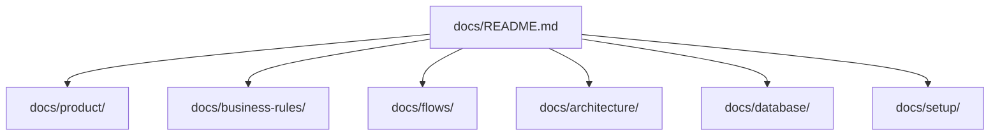

# TakeSeat Technical Documentation Map

## Overview
This index serves as the master navigator ("single source of truth") for the TakeSeat waitlist system documentation, mapping business rules, system architecture, database structure, and integration specifications.

## Responsibilities
- Map all documentation directories for engineering, product, and AI agents.
- Establish cross-references across all functional areas.

## Architecture / Flow

## Documentation Directories

### 1. Product & Design System
- **[Product Specs](./product/features.md)**: Product modules, scope boundaries, and dashboard features.
- **[Design Foundations](./design-system/foundations.md)**: Terracotta palette, typography, visual tokens, and responsive mobile-first guidelines.
- **[UI Component Kit](./design-system/components.md)**: Reusable components, state indicators, layout shells, and responsive controls.

### 2. Architecture & Codebase Design
- **[System Architecture Overview](./architecture/overview.md)**: Multi-tenant logical isolation, stateless Lambda serverless design, and communication diagrams.
- **[System Components](./architecture/components.md)**: Core technology stacks, migration runners, and backend domain service separation.
- **[Backend Architecture](./backend/backend-architecture.md)**: Project layouts, Express controller routes, database service logic, and Zod validator schemas.
- **[Frontend Architecture](./frontend/frontend-architecture.md)**: React workspace layout, route gates, context state managers, and locale systems.

### 3. Business Rules & Operations
- **[Queue Rules](./business-rules/queue-rules.md)**: Wait time logic, queue positioning rules, status workflows, and return timers.
- **[Customer Rules](./business-rules/customer-rules.md)**: CRM indexing constraints, validation formats, and activity audit histories.
- **[Subscription Rules](./business-rules/subscription-rules.md)**: Free trials, pricing plan gates, billing states, and access limits.

### 4. Database & Models
- **[Database Schema Overview](./database/schema-overview.md)**: Relationship diagrams, Prisma schemas, index optimization, and seed configurations.
- **[Restaurant Tenant Model](./database/entities/restaurants.md)**: Settings fields, localized timezones, and configuration structures.
- **[Customer Entity](./database/entities/customers.md)**: CRM columns, DDI numbers, and visit counters.
- **[Waitlist Entry Entity](./database/entities/waitlist.md)**: Party sizes, status state machines, and obfuscated tokens.
- **[Subscriptions Entity](./database/entities/subscriptions.md)**: Billing status fields, payment flags, and trial windows.

### 5. Flows & Integrations
- **[Authentication Flow](./flows/authentication-flow.md)**: Staff credentials verification, JWT issuance, and guest tracking access tokens.
- **[Billing & Trial Flow](./flows/billing-and-trial-flow.md)**: State transitions, trial timeouts, and payment processing gates.
- **[Queue Lifecycle Flow](./flows/queue-flow.md)**: Joining queues, status updates, calls, and seating actions.
- **[Reporting & KPIs Flow](./flows/reporting-flow.md)**: Analytics queries, performance computations, and exports.
- **[User Management Flow](./flows/user-management-flow.md)**: Operator provisioning, roles checking, and password modifications.
- **[WhatsApp Notification Flow](./flows/whatsapp-flow.md)**: Trigger schedules, template compiler runs, and delivery updates.
- **[WhatsApp Integration](./integrations/whatsapp.md)**: Z-API configurations, template parameters, and rate-limits.
- **[Stripe Billing Integration](./integrations/stripe.md)**: Webhook endpoints, Checkout redirections, and payment sync.

### 6. Operations & Guidelines
- **[Security Overview](./security/security-overview.md)**: JWT verification, logical isolation rules, password hashing, and transport safety.
- **[AI Agent Guidelines](./ai-context/agent-guidelines.md)**: Code invariants, viewport locks, and validation rules.
- **[System Context Diagram](./ai-context/system-context.md)**: Actor relationships and external bounds.
- **[Domain Glossary](./ai-context/domain-glossary.md)**: Definitions of entities, calculations, and terms.
- **[Local Setup Guide](./setup/local-setup.md)**: Docker commands, Prisma seed, and dev server launches.
- **[Troubleshooting Guide](./troubleshooting/troubleshooting-guide.md)**: Resolution workflows for connection, Z-API, and webhook errors.
- **[API Reference](./reference/api-reference.md)**: REST paths, JSON request body rules, and response objects.
- **[Architectural Decisions](./decisions/)**: Records of decisions, alternatives, and trade-offs.

## Related Documents
- [Features List](./product/features.md)
- [System Architecture Overview](./architecture/overview.md)
