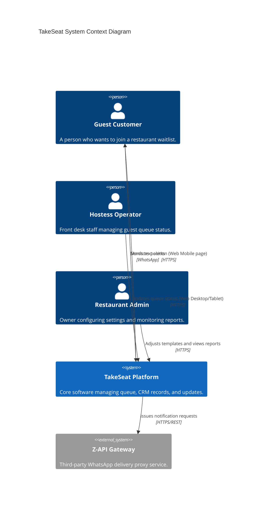

# System Context

## Overview
This document defines the boundaries of the TakeSeat waitlist platform, listing user actors, external integrations, and core system boundaries.

## Responsibilities
- Define actors (Guest Customers, Host Operators, Restaurant Admins).
- Establish communication boundaries with messaging gateways (Z-API).
- Delineate feature inclusions from system exclusions.

## Architecture / Flow

## Rules
- **Authentication Border**: Guests do not log in. Guest access is authorized exclusively via a secure obfuscated hash parameter within their waitlist tracking link.
- **Provider Decoupling**: All messaging requests route through Z-API interfaces. The core system remains platform-agnostic to facilitate transitioning to alternative providers (Meta Cloud API).

## Edge Cases
- **Unverified Phone Delivery**: Z-API requires a valid destination number digits sequence. Delivery to invalid numbers will fail silently or return error logs to the webhook listener.

## Technical Notes
- Integrates with Z-API endpoints using credentials stored in system variables.

## Related Documents
- [System Architecture Overview](../architecture/overview.md)
- [WhatsApp Integration](../integrations/whatsapp.md)
