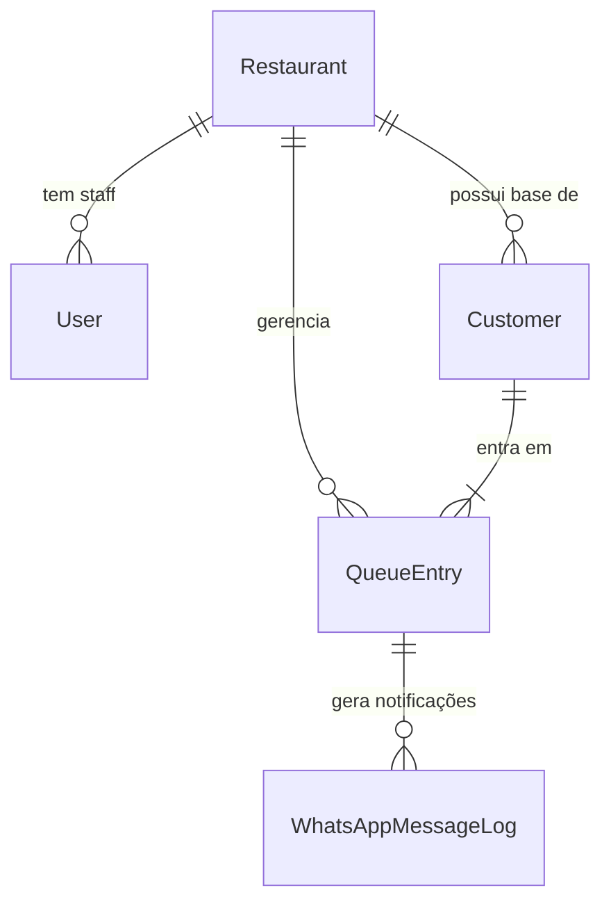

# Modelo de Dados (Alto Nível)

O modelo de dados é relacional e centrado no conceito de **Restaurant** como unidade de isolamento (Tenant).

## Entidades Principais

### 1. Restaurant (Business)
*   **Papel:** Representa a entidade pagante/usuária do sistema (o estabelecimento).
*   **Campos Chave:** `id`, `name`, `slug` (para URL pública), `settings` (JSON com configs).
*   **Isolamento:** Quase todas as outras tabelas possuem uma FK `restaurantId`.

### 2. User (Staff)
*   **Papel:** Usuários que operam o sistema (Admin, Gestor, Operador).
*   **Campos Chave:** `email`, `password_hash`, `role`.
*   **Relação:** Pertence a um ou mais Restaurantes (muitos-para-muitos ou um-para-um dependendo da implementação atual - *Verificar: atualmente parece 1-N, user pertence a um restaurant*).

### 3. Customer (CRM)
*   **Papel:** O cliente final que frequenta o restaurante.
*   **Campos Chave:** `phone` (identificador primário), `name`, `notes`.
*   **Multi-tenant:** Um cliente é único por restaurante ou global?
    *   *Design Atual:* O cliente é geralmente vinculado ao restaurante (`restaurantId`), permitindo notas específicas por estabelecimento.

### 4. QueueEntry (Fila)
*   **Papel:** Uma entrada ativa ou histórica na fila de espera.
*   **Campos Chave:**
    *   `restaurantId`, `customerId`.
    *   `partySize` (tamanho da mesa).
    *   `status` (WAITING, CALLED, SEATED, CANCELLED, NO_SHOW).
    *   `token` (hash para acesso público seguro).
    *   `waitingSince` (timestamp de entrada).

### 5. WhatsAppMessageLog (Logs)
*   **Papel:** Registro de auditoria de mensagens enviadas.
*   **Campos Chave:** `restaurantId`, `customerId`, `type` (WELCOME, CALL, etc), `status`, `providerMessageId`.

### 6. Settings (Configurações)
*   Atualmente, as configurações podem estar normalizadas em tabelas específicas ou serializadas em campos JSON na tabela `Restaurant`.
*   **WhatsApp Settings:** `isEnabled`, `sendWelcome`, `welcomeText`, etc. Normalmente armazenado como parte das configurações do restaurante.

## Diagrama ER Simplificado

