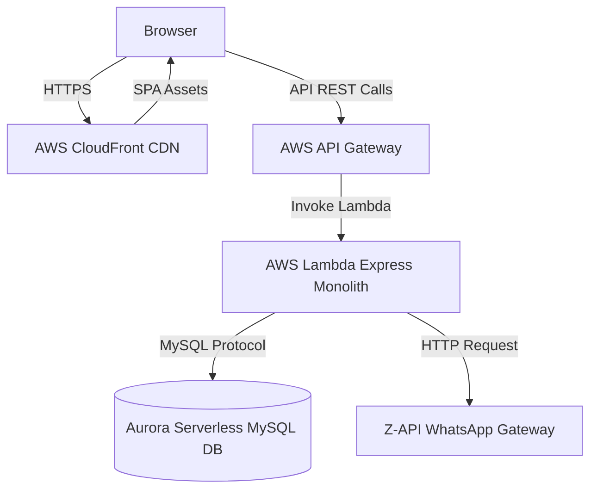

# System Architecture Overview

## Overview
TakeSeat is a multi-tenant SaaS platform built to replace physical guest pagers and paper waitlists in hospitality. It routes guest actions, updates table queues, and notifies customers via WhatsApp.

## Responsibilities
- **Multi-Tenant Isolation**: Scope all business data operations under logical partition identifiers.
- **Serverless Scaling**: Manage API scaling dynamically with zero idle server overhead.
- **Pluggable Messaging**: Abstract SMS and WhatsApp integrations to support easy provider changes.

## Architecture / Flow
1. **Hostess UI**: SPA frontend loaded from CDN issues HTTPS REST requests.
2. **API Gateways**: AWS API Gateway forwards requests to AWS Lambda running Express.
3. **Domain Services**: Handlers query the MySQL database, execute state machines, and enqueue notifications.
4. **Outbound Messaging**: Service dispatches webhook payloads to Z-API for message delivery.

## Rules
- **Logical Tenant Partitioning**: The database table structure uses `restaurantId` on all operational entities. Every read, write, update, and deletion must scope queries with this ID.
- **Stateless Execution**: All runtime data must persist in MySQL. Local server memory must not cache session variables.

## Edge Cases
- **Database Connection Caps**: Aurora MySQL connections are pooled and limited to prevent server exhaustion during Lambda concurrency spikes.

## Technical Notes
- Multi-tenancy is logical, utilizing a shared database instance with tenant index scopes.

## Related Documents
- [Backend Architecture](../backend/backend-architecture.md)
- [Frontend Architecture](../frontend/frontend-architecture.md)
- [Database Schema](../database/schema-overview.md)
