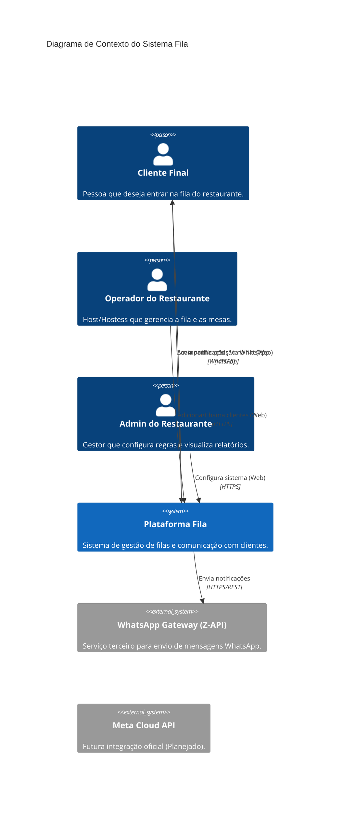

# Contexto do Sistema

Este documento descreve as fronteiras do sistema Fila e suas interações com atores externos e sistemas terceiros.

## Diagrama de Contexto (C4)

## Detalhamento das Interações

### Atores

1.  **Cliente Final (Consumidor)**
    *   **Interação:** Passiva (recebe notificações) e Ativa (consulta status da fila via link web móvel).
    *   **Objetivo:** Saber quanto tempo falta para ser atendido sem precisar ficar fisicamente na porta.

2.  **Operador do Restaurante (Host/Hostess)**
    *   **Interação:** Intensa. Utiliza a interface principal de "Mesa/Fila".
    *   **Objetivo:** Adicionar clientes rapidamente, estimar tempos, chamar clientes e liberar mesas.

3.  **Admin do Restaurante**
    *   **Interação:** Esporádica.
    *   **Objetivo:** Configurar textos de mensagens, horários, criar usuários operadores e visualizar métricas de performance.

### Sistemas Externos

1.  **WhatsApp Gateway (Z-API)**
    *   **Tipo:** Integração atual (POC/MVP).
    *   **Função:** Ponte entre nossa API e a rede do WhatsApp. Simula uma instância de WhatsApp Web vinculada a um QR Code.
    *   **Fluxo:**
        *   Fila -> Z-API: Envio de texto (POST /send-text).
        *   Z-API -> Fila: Webhooks de status de entrega e desconexão (se configurado).

2.  **Meta Cloud API (Futuro)**
    *   **Planejamento:** Substituirá a Z-API para maior estabilidade e compliance oficial.
    *   **Impacto:** A arquitetura já prevê essa troca através da interface `IWhatsAppProvider`.

## Limites do Sistema

*   **DENTRO:**
    *   Lógica de fila e estimativa de tempo.
    *   Armazenamento de dados de clientes e histórico.
    *   Interface web responsiva para gestão.
    *   Interface web pública para acompanhamento (status page do cliente).

*   **FORA:**
    *   Delivery de mensagens (delegado ao WhatsApp).
    *   Gestão profunda de identidade do cliente final (não temos login para o consumidor final, apenas identificação por telefone).
    *   Pagamentos (fora do escopo atual).
