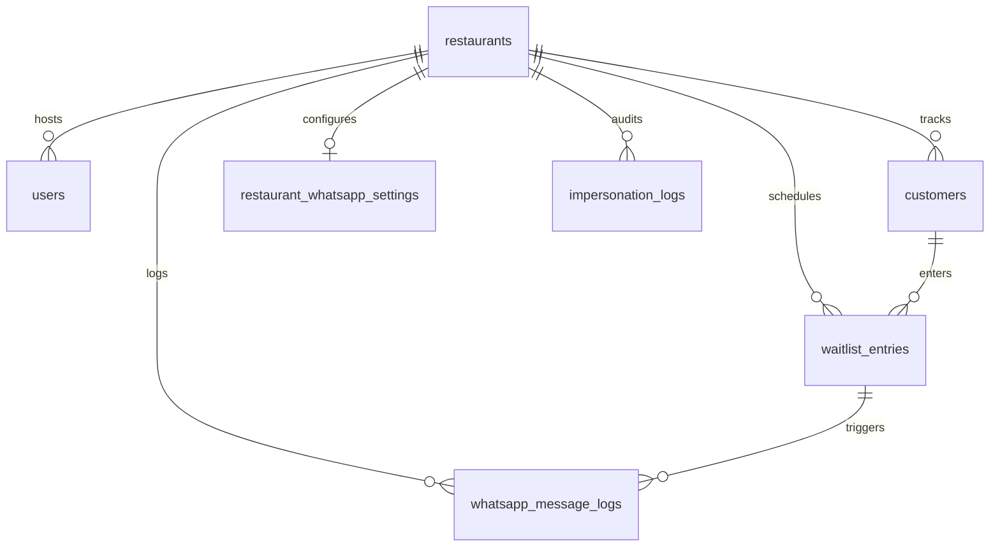

# Database Schema Overview

## Overview
TakeSeat uses a MySQL relational database managed via Prisma ORM. The schema is optimized for multi-tenant isolation, high-speed waitlist queries, audit logging, and customer record deduplication.

## Responsibilities
- **Multi-Tenant Partitioning**: Ensure all operational entities map back to a specific `Restaurant` parent.
- **Deduplication Safeguards**: Apply database-level unique keys to prevent duplicate active users.
- **Operational Auditing**: Retain records of message logs and administrator impersonation actions.

## Architecture / Flow

## Rules
- **Foreign Key Cascade Deletions**: Deleting a `Restaurant` cascade-deletes its associated `User`, `Customer`, `WaitlistEntry`, `RestaurantWhatsAppSettings`, and audit records.
- **Compound Unique Keys**: The `Customer` table has a composite unique constraint `@@unique([restaurantId, fullPhone])` to ensure unique customer identity profiles per tenant.
- **Database Migrations**: All schema alterations must be handled through declarative SQL migration scripts within Prisma (`prisma migrate dev`). Direct database modifications are strictly prohibited.

## Edge Cases
- **Customer Nullification on Queue Deletion**: If a `Customer` is manually deleted from the CRM, connected `WaitlistEntry` records are not deleted; instead, their `customerId` foreign key is set to `null` (`onDelete: SetNull`) to preserve anonymous metrics.

## Technical Notes
- Indexing is heavily applied to `WaitlistEntry` on composite keys `(restaurantId, status, createdAt)` and `(restaurantId, seatedAt)` to optimize the performance of waitlist dashboard loading and reports generation queries.

## Related Documents
- [Backend Architecture](../backend/backend-architecture.md)
- [Subscription Rules](../business-rules/subscription-rules.md)
- [Setup Guide](../setup/local-setup.md)
