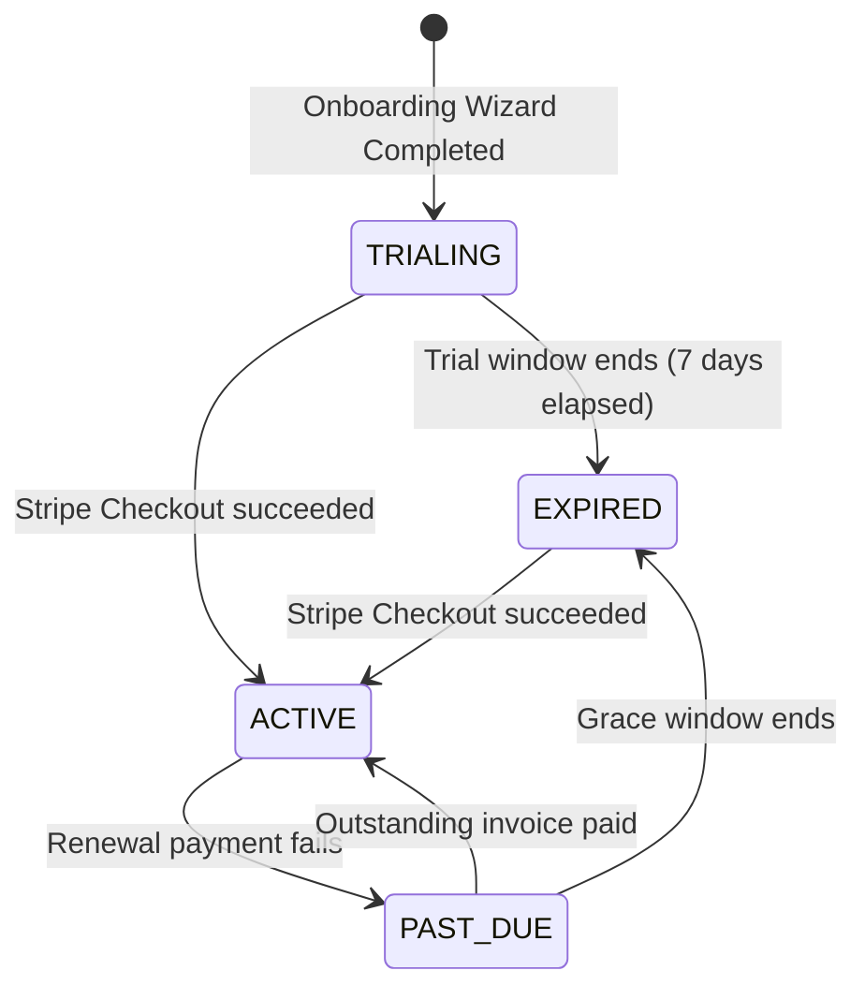

# Billing and Trial Flow

## Overview
TakeSeat operates a subscription SaaS model. Restaurants register under a 7-day free trial, transitioning later into active paid subscriptions or suspended states based on invoice payment events.

## Responsibilities
- Track trial period durations and trigger expiration.
- Handle checkout creation and process payment outcomes.

## Architecture / Flow

## Rules
- **Onboarding Start**: New tenants default to plan `PRO` and status `TRIALING` for exactly 7 days.
- **Access Restrictions**: Features are locked when status is `EXPIRED` or `PAST_DUE`. The dashboard routes requests to `/billing`.
- **Payment Reconciliation**: Subscription activations and payment failures are handled asynchronously via verified Stripe Webhooks.

## Edge Cases
- **Trial Expired Job**: A backend scheduled automation monitors date boundaries and updates expired `TRIALING` tenants to `EXPIRED`.

## Technical Notes
- Subscriptions are checked via the `canAccessFeatures` method on `SubscriptionService`.

## Related Documents
- [Subscription Rules](../business-rules/subscription-rules.md)
- [Stripe Integration](../integrations/stripe.md)
