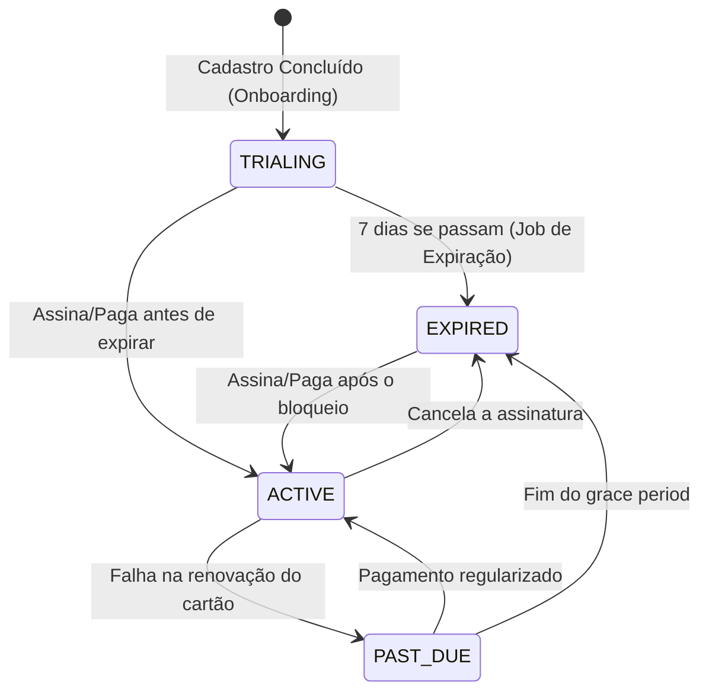

# Ciclo de Vida da Assinatura e Trial (Billing Flow)

O TakeSeat opera em um modelo SaaS com **Plano Único (PRO)**. O fluxo de monetização é composto por um período de testes gratuito (*trial*) seguido de bloqueio ou transição para uma assinatura paga contínua. 

O plano legado `BASIC` foi descontinuado; todos os *tenants* (restaurantes) no sistema pertencem ao plano `PRO`. O que dita o acesso aos recursos é o **Status da Assinatura** (`subscriptionStatus`), e não a mudança de pacotes.

---

## 1. Fluxo de Vida do Status (`SubscriptionStatus`)

O ciclo de vida da conta passa pelos seguintes estágios (`enum SubscriptionStatus`):

---

## 2. Regras de Negócio Detalhadas

### A. Criação da Conta e Início do Trial (`TRIALING`)
Quando um restaurante conclui o processo de Onboarding:
- O campo `plan` é fixado como `PRO`.
- O `subscriptionStatus` é setado para `TRIALING`.
- Uma janela exata de **7 dias de teste** é calculada (`trialStartAt` e `trialEndAt`).
- **Acesso:** Total (100% dos recursos estão liberados).

### B. Expiração do Teste (`EXPIRED`)
O controle de expiração não acontece online a cada requisição, mas sim através de uma rotina de automação (*Cron Job*):
- O **`TrialExpirationJob`** roda em background avaliando a base de dados.
- Se a data atual for maior que o `trialEndAt` de uma conta em `TRIALING`:
  - O `subscriptionStatus` é alterado de `TRIALING` para `EXPIRED`.
- **Acesso:** Bloqueado. O *middleware* global intercepta as chamadas e o Frontend exibe a tela de obrigatoriedade de configuração de pagamento (inserção de cartão). O plano tecnicamente continua sendo `PRO`.

### C. Ativação da Assinatura (`ACTIVE`)
Caso o restaurante decida assinar (seja durante o Trial ou após ele ter expirado):
- O sistema de pagamento (ex: Stripe) aprova o cartão.
- O método `activateSubscription()` é invocado.
- O `subscriptionStatus` muda para `ACTIVE`.
- O ciclo de renovação (`subscriptionEndsAt`) passa a respeitar as datas do Gateway de Pagamento.
- **Acesso:** Restaurado ou mantido. Operação contínua.

### D. Inadimplência ou Falha no Cartão (`PAST_DUE`)
Caso o pagamento falhe no momento da renovação mensal:
- O sistema ou Webhook notifica o Backend da falha de cobrança.
- O status muda para `PAST_DUE`.
- Inicia-se um período de tolerância (*grace period*).
- Se a fatura não for paga no período de tolerância, a conta eventualmente reverte para `EXPIRED`.

---

## 3. Segurança e Middlewares

No Backend, o acesso é protegido por middlewares. A autorização baseada em pagamento ocorre na verificação do `canAccessFeatures()` dentro do `SubscriptionService`.

Apenas contas `TRIALING` ou `ACTIVE` têm as requisições liberadas pelo proxy. Qualquer outro status força o retorno de um **HTTP 403 (Payment Required / Access Denied)** instruindo a aplicação cliente a empurrar o usuário para o funil de pagamento.
